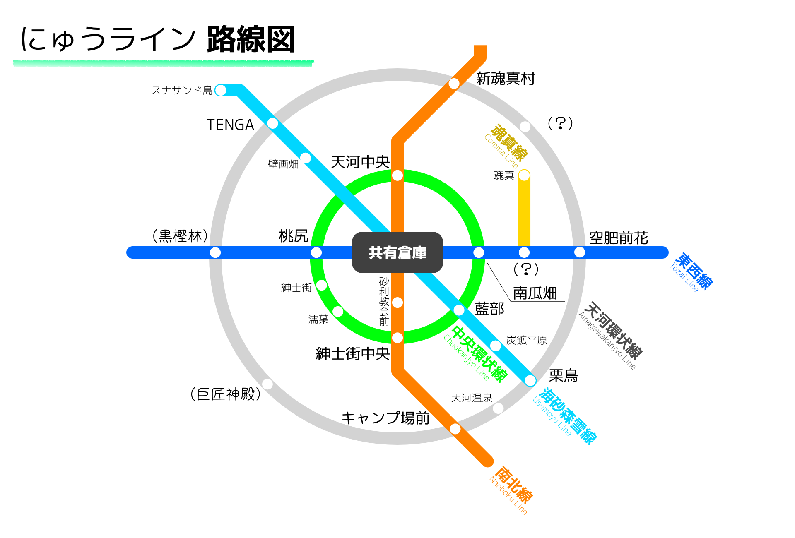

にゅうラインはワールド全体に張り巡らせている鉄道です。

## 大まかな路線図

参考までに[昔の路線図](old-routes.md)も一応残しておきます。

## 路線一覧
* **東西線**
	* 東西を繋ぐ一本の路線です。地下鉄です。
	* 状況：桃尻～駅名未定(元栗鳥)間開通。
* **南北線**
	* 南北を繋ぐ一本の路線です。
	* 高架線の部分も地下鉄の部分もあります。
	* 状況：実質完全開通。ただし南に伸びる可能性大。
* **魂真線**
	* 南瓜畑駅と魂真駅を繋ぐローカル線です。高架線です。
	* 状況：たぶん開通。
* **中央環状線**
	* リスポーン地点周辺を一周する環状線です。地下鉄です。
	* 状況：完全開通。
* **天河環状線**
	* 天河地方全体を一周する環状線です。
	* 状況：未着手
* **海砂森雪線**
	* 南東から北西まで繋ぐ一本の路線です。
	* 名前は色々な場所に繋がっている事に由来します。
	* 高架線の部分も地下鉄の部分もあります。
	* 状況：ほぼ開通
